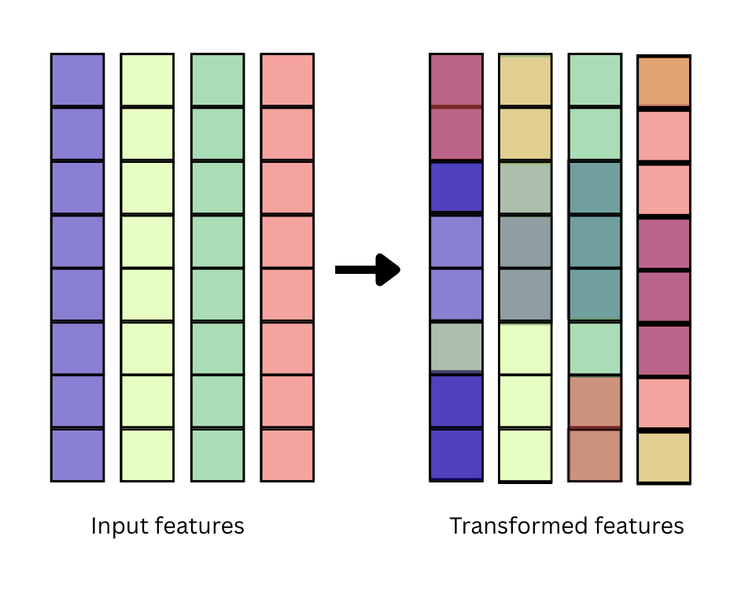

# A primer on feature attribution for autoregressive language models 

$\textbf{Introduction.}$
In this blog article, I aim to synthesize, and reconstitute all my learnings of feature attribution in the summer of ’26 into my own mental framework. As part of this synthesis process, I chose to not use LLMs to plan or write this article. I wanted to practice choosing, framing, and establishing context that I thought was important. 


- An overview of the differences between explainable AI and the modernized version of attributional interpretability. 
- Aim to describe the broad of feature attribution methods for autoregressive language models, attribution contract.
- Aim to show an example of a few methods and describe how it works intuitively

## What is feature attribution? 
Feature attribution aims to identify inputs that are responsible for a model's response. Feature attribution belongs to a subfield of mechanistic interpretability known as attributional interpretability. Attributional interpretability is broadly split into three families, where outputs are traced back to features (i.e., feature attribution), internal components (i.e., internal attribution), or second-order effects of training data (i.e., data attribution). A feature attribution method assigns importance scores to input features; for an autoregressive language model, this would mean assigning importance scores to context tokens. 

Attribution methods should specify an attribution target, $O$, as the specific output feature held as the objective to interpret, the source context, $C$, over which relevance scores are derived for, and an algorithmic schema $f(x)$ that outlines how to derive feature influence from an output feature. An attribution method produces an attribution map $\phi$ as a bounded probability distribution that spans the source context, denoting individual feature influence on the output. Taken together, attribution aims to trace, explain, and ascribe model behavior back to components. 

### Setting the right attribution objective 
A key question to ask yourself is what do you want to attribute? This may seem trivial, but, in fact, could yield drastically different attribution performance. Take this sentiment classification for instance, suppose I want to attribute over the response: 

> Prompt: I did not like the movies because my neighbors could not stay quiet and the theater room was not air conditioned. What is the sentiment? Answer simply. 
>> Answer: The 

> Prompt: I did not like the movies because my neighbors could not stay quiet and the theater room was not air conditioned. What is the sentiment? Answer simply. 
>>  Answer: The sentiment is negative. 

Attribution over the word “*the*” could prioritize influence of the question because it motivates the directive or the answer. Whereas, attribution over “*negative*” might yield better saliency maps over context features that were responsible in computing the actual sentiment classification. In other words, attribution scores are relative to target attribution objectives. Given that we have an underspecified attribution objective, this does not imply that one attribution map is necessarily superior to another.

## Taxonomy of feature attribution methods 

| Family | Examples | Observation |
| --- | --- | --- |
| Content mixture | Attention Rollout, Aggregation of Layerwise Token Interactions (ALTI) | Mixture of token embeddings from the residual stream |
| Gradient-based | Integrated Gradients (IG), Input × Gradients | Approximates a first-order Taylor approximation via local linearization |
| Perturbation-based | Randomized Input Sampling for Explanation (RISE) | Ablations, occlusions, or perturbations to an input feature lead to downstream influence |


There are three foundational approaches towards feature attribution: content mixture, gradient-based, and perturbation-based approaches. 

### Content mixture approaches 


**Figure 1**: A visual of representational embeddings becoming increasingly mixed with original input embeddings.

First, content mixture aims to quantify and score how input context features write to other input context positions. Under the residual stream perspective [(Elhage et al. 2021)](https://transformer-circuits.pub/2021/framework/index.html), the residual stream (L, N, d) acts as an aggregate channel or ledger that incorporates additive contributions of other tokens. As such, each token’s representation becomes thoroughly mixed with representation of other tokens [(Brunner et al., 2022)](https://arxiv.org/pdf/1908.04211).  Brunner formalizes the notion of token identifiability as whether a “as the existence of a mapping assigning contextual embeddings to their corresponding input tokens”. In other words, for a given hidden representation of the residual stream at layer l, can we predict that latent representation with the original context embeddings? A token is identifiable if we can decode which input embeddings have contributed to that representation. Brunner et al. discovers that representations from later layers of the residual streams become increasingly mixed with more tokens and can predominantly represent other features.  The implication is that a given token that contributes heavily to the attribution target does not merely indicate contributions from that one token but also other input features that are identifiable from that position.  Content mixture approaches exploits this phenomenon of token mixture by attempting to track the composition of context embeddings that comprise a given hidden representation and then to use  to score output contribution. 

Popular attention based approaches include variants of Attention Rollouts [(Abnar & Zudeima, 2020)](https://arxiv.org/pdf/2005.00928), Aggregation of Layerwise Token Interactions (ALTI) [(Ferrando et al., 2022)](https://arxiv.org/html/2602.01914), GlobEnc [(Modarressi et al., 2022)](https://aclanthology.org/2022.naacl-main.19.pdf), and more recently, FlashTrace [(Pan et al., 2026)](https://arxiv.org/html/2602.01914). Early works of content-mixture approaches evaluate input saliency with respects to attention patterns, combining methods like *matrix rollouts[^1]* that aggregates and quantifies influence across layers. But, attention weights alone may not be sufficient to describe which features the model use to form predictions [(Wiegreffe & Pinter, 2019)](https://aclanthology.org/D19-1002.pdf). As such, [Kobayashi et al](https://aclanthology.org/2020.emnlp-main.574.pdf) proposed a norm-based analysis that evaluates the value-projected embeddings scaled by their respective attention weights, which improved explanatory faithfulness. Since then, other works have widened the horizon of their algorithmic schema beyond the attention mechanism to the broader transformer architecture. These innovations involve the incorporation of the residual skip connections (or sometimes called residual bypass), multi-layer perceptron (MLP) subcomponents, normalization layers, bias terms, and the decoder modules.  


#### An example case study with FlashTrace  

FlashTrace was introduced by Pan et al., and had many similarities with ALTI and Information Flow Routes. These methods try to quantify how each layer's input features contributes to the residual stream and then try to aggregate it towards an attribution map. 
Given that transformer residual streams are highly anisotropic, $\ell_2$ norm is dominated by directions with high variance. As such, FlashTrace uses the $\ell_1$ norm which is more robust to anisotropicity. The proximity metric is defined below as: 
$$
\begin{equation}
    \mathrm{Proximity(x, y)} = \mathrm{max}(-||y||_{1} + ||y-x||_{1}, 0), \quad \mathrm{where} \;\; x, y \in \mathbb{R^{d_\mathrm{model}}}
\end{equation}
$$


Intuitively, it captures how much does a vector contributes to the residual stream. It represents the resultant difference in distance between $y$ with and without a contribution, $x$. Using the residual stream perspective, we can decompose the contribution of the residual stream into two components: attention write and MLP writes.

$$
\begin{equation}
x^{\text{mid},\,\ell}_i = x^{\ell}_i + \underbrace{\sum_{h=1}^{H} \sum_{j} \alpha^{\ell,h}_{ij}\, W^{\ell,h}_{OV}\, x^{\ell}_j}_{\mathrm{attention\; write}}
\end{equation}
$$
$$
\begin{equation}
x^{\text{out},\,\ell}_i = x^{\text{mid},\,\ell}_i + \underbrace{W^{\ell}_{\text{out}}\!\left(W^{\ell}_{\text{in}}\, x^{\text{mid},\,\ell}_i + b^{\ell}_{\text{in}}\right) + b^{\ell}_{\text{out}}}_{\mathrm{mlp \; write}}
\end{equation}
$$

Methods like FlashTrace and ALTI computes the proximity of the contributions of the attention write, $r_{ij}$ to the residual stream: $\mathrm{Proximity}(r_{ij}, x^{mid}_i)$. They similar do this for MLP contributions $\mathcal{c}_i$, $\mathrm{Proximity}(c_i, x^{out}_i)$. However, the flow of information to the residual stream comes from an additional competing source, namely, the residual skip connections. At $x^{mid}$, the residual skip connection is the flow of a prior layer's hidden representations (layer 1's would be input embeddings). At $x^{out}$, the residual skip connection is the flow of the prior attention submodule output. One way to practically address this is to calculating the *proportion* of contribution of each token to the residual stream against all the sources of contribution: $\mathrm{Prox_{Attn}} / (\mathrm{Prox_{Attn}}) + (\mathrm{Prox_{x^{\ell-1}}})$. This is similarly done for the MLP contributions. 

FlashTrace differs with ALTI largely by aggregation mechanism. For instance, ALTI follows a popular method of *matrix rollout* where contributions are stacked into a matrix over source and destination dimensions for each layer and rolled out via matrix multiplications. FlashTrace, however, simply aggregates layerwises and uses the proportion of MLP contribution as a convex weight to score each layer's influence for the final attribution map, $\phi$. 


Let's see how this works in practice. We'll be using HuggingFace's transformer libraries because they expose endpoints that are pretty easy to use. We'll need to write some functions to do the following: 

1. Extract attention patterns via the HuggingFace 
2. Compute the value-weighted output vector, $W_{OV}$
3. Scale value-weighted output vector with attention weights to get attention write 
4. Take proximity of attention write to the residual stream
5. Take proximity of MLP write to the residual stream
6. Normalize each contribution from attention and MLP component with respective outputs 
7. Aggregate token interactions layerwise, while weighting weighting each layer 

```python
from dataclasses import dataclass 
from transformers import AutoModelForCausalLM, AutoTokenizer
from typing import Optional

# Assuming x and y are is (1, d_model) 
def compute_proximity(x: torch.Tensor, y: torch.Tensor) -> torch.Tensor:
    """Computes L1 proximity."""
    y_dist = y.sum(dim=-1)
    diff_dist = (y - x).sum(dim=-1)
    prox = tmax(0, diff_dist - x_dist) 
    return prox 

@dataclass
class FlashTrace: 
    inputs: str # input texts 
    outputs: Optional[str] 
    model_name: str # HuggingFace model 

    def _load_model(self): 
        """Load HuggingFace model."""
        self.model = AutoModelForCausalLM.from_pretrained(self.model_name) 
        self.tokenizer = AutoTokenizer.from_pretrained(self.model_name)

    def _tokenize_inputs(self) -> torch.Tensor: 
        """Tokenize input features."""
        self.input_tokens = self.tokenizer.encode(self.inputs, return_tensors="pt")

    def _capture_input_embeddings(self): 
        """
        Capture input embeddings of the model.
        """
        self.init_embeddings = self.model.get_input_embeddings()(self.input_tokens) # Note that `.get_input_embeddings` returns W_embed and nn.Parameter which takes input tokens and maps to their respective input embeddings

    def generate(self): 
        """
        Generate responses and cache attention and internal activations 
        """
        out = self.model.generate(
                **self.input_tokens, 
                max_new_tokens=20, # new tokens to generate 
                use_cache=True, # caches key value matrices to speed up decoding 
                cache_implementation="quantized",
                output_attention=True, # cache (L, H, N, N) matrix 
                output_hidden_states=True, # cache (L, N, d),
        )
        self.attention = out.attention
        self.hidden_states = out.hidden_states 
```
Now, we compute the attention-weighted value vectors. Practically, this may be more challenging since materializing the full $(L, H, N, N)$ matrix can be extremely memory-intensive but unavoidable. It might be worth batching the computation of the OV circuit by iterating through the model parameters to computing the $XW_{V}W_{O}$ and deleting the unused weights to prevent excessive peak memory.[^2]
```python
    def compute_OV_circuit(self):
        """
        We can compute OV circuit as follows: 
            W_ov = X @ W_V @ W_O
        - The dimensions of X are (L, N, d_model); 
        - the dimensions of W_V are (d_model, d_head) -> (d_model, head, d_head); 
        - the dimensions of W_O are (d_head, d_model) -> (d_head, head, d_model); 
        """
        num_heads = self.model.config.num_attention_heads
        d_model = self.model.config.hidden_size 
        d_head = d_model // num_heads 

        contribs = []
        for i, layer in enumerate(self.model.model.layers): 
            W_V = layer.self_attn.v_proj.weight.T.reshape(d_model, num_heads, d_head)
            W_O = layer.self_attn.o_proj.weight.T.reshape(d_head, num_heads, d_model)
            x = self.input_embeddings if i == 0 else self.hidden_states[i-1]
            W_OV = torch.einsum("inh,hno->ino", W_V, W_O)
            contrib = torch.einsum("si,ino->sno", x, W_OV)
            contribs.append(contrib)
            del W_OV, W_V, W_O, x 

        full_contribs = torch.stack(contribs, dim=0)
        return full_contribs 
    
    def compute_attention_write(): 
        
    
    def compute_attention_write_proximity(self, contributions: torch.Tensor, residual_stream: torch.Tensor) -> torch.Tensor: 
        """
        Take contribution matrix that is (L, S, H, d) and score each head's L1 proximal contribution to the residual stream 
        """

```


### Gradient-based approaches 

A given $n$-th order Taylor approximation of a function is: 
$$
\begin{equation}
\mathcal{F}(x) \approx \sum_{i=0}^{n} \frac{\mathcal{f}^{(\mathcal{i})}(x_{0})}{\mathcal{i}!} (x-x_{0})^i
\end{equation}
$$

A $0$-4th order approximation is simply a horizontal line at $x_0$. The first order approximation is as follows: 
$$
\begin{equation}
    \mathcal{F}(x) \approx f(x_{0}) + \underbrace{f'(x_0)}_{\substack{\mathrm{Jacobian} \\ \mathrm{gradients}}}(x - x_{0})
\end{equation}
$$
and its' second order-approximation is: 
$$
\begin{equation}
\mathcal{F}(x) \approx f'(x_{0})(x-x_{0}) + \frac{1}{2}\underbrace{f''(x_0)}_{\substack{\mathrm{Hessian} \\ \mathrm{gradients}}}(x - x_0)^2
\end{equation}
$$

**Equation 1**: We can use Jacobian and Hessian gradients for the first order and second order derivative, respectively. These are fairly simple to compute with Pytorch. 

LLMs are deep neural networks composed of modules that perform linear and nonlinear computation to map input features (x) to the outputs (y). One way of thinking of these networks is abstracting the internal complexity and thinking of the functions as one amorphous, complex non-linear transformation. Geometrically, we can view the transformation as points moving along a curved, multidimensional manifold. We can approximate the functional relationship around an analytic point with a Taylor series expansion. Under a local linearity assumption, we can write a first-order Taylor approximation of the network behavior. In line with a geometric view, this is akin to fitting a tangent line at the point, where the slope of the tangent line is the first order derivative of the function evaluated at that point. In essence, the local linearity assumption allows us to zoom into the local neighborhood and determine the linear dependencies. 

We can also adopt the view of gradients as estimates of causal influence of output given small perturbations to input features. Imagine if we make an infinitesimal nudge to the input features, how does that affect the output features? The **Jacobian gradient** of a function $\mathcal{F}:\mathbb{R}^n \rightarrow \mathbb{R}^m$ is an $m{\times}n$ matrix that describe local estimate of the influence mapping between inputs and outputs. The row entries, $m$ denotes how all input features affect one scalar value of the output. The column entries describe a given $n$-th input feature's influence over the output feature  its influence over the output features. [Maxime Roebyns](https://maximerobeyns.com/of_vjps_and_jvps) provides a very good intuitive explanation around Jacobian. We can obtain a saliency map over the $m$ input features by projecting the input features onto the Jacobian matrix $\phi_{m} = \mathrm{x}^T_{m}J$.   

### Perturbation-based approach 
The core idea of perturbation-based approaches is to quantify how perturbation to input features can lead to changes in output behavior. There are many ways to perturb an input features. We could ablate or remove a specific word and then induce generation over output, measuring changes in multi-token output probability distribution or logit values. Additionally, we can inject Gaussian noise into input embeddings and similarly induce generation. There are concerns where simply ablating context tokens might push model behavior out of distribution, so other work have explored substituting words for padding tokens or other in-distribution special tokens. 

### Where are we?

I suppose that I should have to preface here that I am by no means an attribution expert. A real expert would have significant breadth and depth of many of the attribution methods, their respective strengths and limitations, and likely better intuitions and mental frameworks to make sense of the current scientific landscape. In other words, a real expert would have better research taste and judgement. They can better conceptualize what are the current dilemmas and open-ended questions of our field and how we might shape attributional interpretability for scientific discovery, real world decision-making, and actionable insights.  Nonetheless, I am providing my non-expert account of what I see are open-ended questions and current problems: 

- Multi-layer perceptrons comprise nearly $\frac{2}{3}$ of the total parameters of a language models and contain factual information but are seldom used for cross-token attribution. Given that they make individual positional writes to the residual stream, which can be viewed as a self-contribution, it is hard to account for any signature of inter-token communication here. Past methods have merely integrated these contributions as part of normalization factors accounting for that layer’s general contribution to the network output. Could we find a way to attribute MLP for cross-token influence? 
- How do we scale attribution towards long-horizon contexts? Recent work has proposed recursive attribution (Pan et al.) but how do we attribute different parts of the prompt without prior contextual dependencies?
- How should we account for extended outputs? Should we attribute over all outputs? I’ve attempted to answer this question in a preprint in my summer internship at Noblis! I hope to share some early findings soon. 


[^1]: Matrix rollouts are computed via chained matrix multiplications $\tilde{A}{^L} = \tilde{A}^{L-1}\dots \tilde{A}^0$. There are different variations of matrix rollouts where one injects an identity matrix as an indication of self-contribution $\tilde{A}^{\ell}=0.5I + 0.5A^\ell$. Some methods simply use $\tilde{A}^\ell = A^\ell.$ Heads are typically fused by taking the average of the entries head-wise. 

[^2]: Additionally, production-ready models may have a greater number of query matrices than key or value matrices ($N_Q \geq N_{KV}$) as in the case of [Grouped Query Attention (GQA)](https://arxiv.org/pdf/2305.13245) or [Multi-Head Latent Attention (MLA)](https://arxiv.org/pdf/2502.07864). As such, one would have to expand the number of key-value heads via `.repeat_interleave` function. 